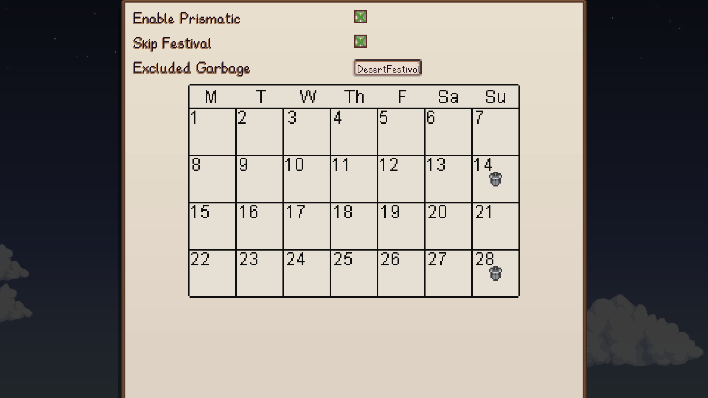
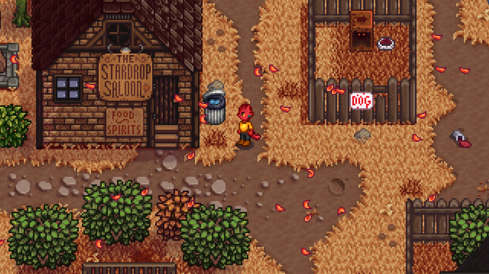
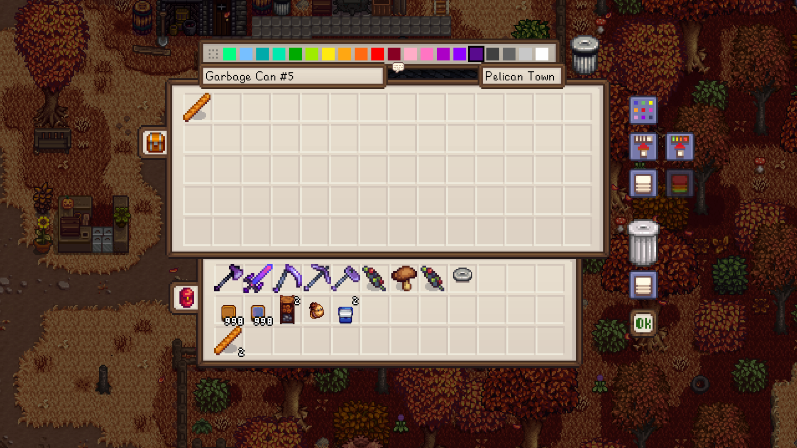

# Garbage Day

Stardew Valley mod which turns garbage cans into special chests. Trash builds up
every day, and on garbage day is it cleared out.

## Table of Contents

- [Garbage Day](#garbage-day)
  - [Table of Contents](#table-of-contents)
  - [Configurations](#configurations)
  - [Features](#features)
  - [Translations](#translations)

## Configurations

For ease of use, it is recommended to set config options
from [Generic Mod Config
Menu](https://www.nexusmods.com/stardewvalley/mods/5098).

## Features

Items will collect daily in the garbage can.

You can retrieve the items any day up until garbage day.

## Translations

❌️ = Not Translated, ❔ = Incomplete, ✔️ = Complete

|            |         Garbage Day          |                Garbage Can                 |
| :--------- | :--------------------------: | :----------------------------------------: |
| Chinese    | [❌️](GarbageDay/i18n/zh.json) | [✔️](<GarbageDay/Garbage Can/i18n/zh.json>) |
| French     | [❔](GarbageDay/i18n/fr.json) | [✔️](<GarbageDay/Garbage Can/i18n/fr.json>)  |
| German     | [❌️](GarbageDay/i18n/de.json) | [❌️](<GarbageDay/Garbage Can/i18n/de.json>)  |
| Hungarian  | [❌️](GarbageDay/i18n/hu.json) | [❌️](<GarbageDay/Garbage Can/i18n/hu.json>)  |
| Italian    | [❌️](GarbageDay/i18n/it.json) | [❌️](<GarbageDay/Garbage Can/i18n/it.json>)  |
| Japanese   | [❌️](GarbageDay/i18n/ja.json) | [❌️](<GarbageDay/Garbage Can/i18n/ja.json>)  |
| Korean     | [❌️](GarbageDay/i18n/ko.json) | [❌️](<GarbageDay/Garbage Can/i18n/ko.json>) |
| Portuguese | [❌️](GarbageDay/i18n/pt.json) | [❌️](<GarbageDay/Garbage Can/i18n/pt.json>)  |
| Russian    | [❌️](GarbageDay/i18n/ru.json) | [❌️](<GarbageDay/Garbage Can/i18n/ru.json>)  |
| Spanish    | [❌️](GarbageDay/i18n/es.json) | [❌️](<GarbageDay/Garbage Can/i18n/es.json>)  |
| Turkish    | [❌️](GarbageDay/i18n/tr.json) | [❌️](<GarbageDay/Garbage Can/i18n/tr.json>)  |